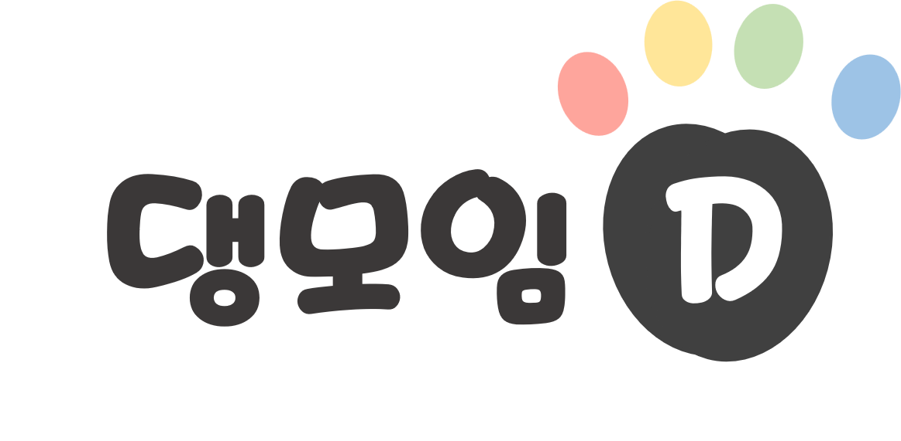

# TeamDang

:information_desk_person: TeamDang 소개
------------------------------
#### :bulb: 개발 목적   
* 반려인들의 친목 댕모임 개설, 정기 모임장소 맞춤 콘텐츠 추천

#### :moneybag: 시장 조사 
  - 출처  

#### :calendar: 개발 일정   
* 기간 :    

#### :computer: 개발 환경   
* Windows 10, 11
* Oracle 11g XE / SQL Developer 22
* HTML5 / CSS3 / JavaScript ES5 / jQuery 3 / Bootstrap 5
* STS 4.15.3 / VS Code 1.68   

:clap: Contributor
---------------
#### 엄현용 https://github.com/Luverduck
* 

#### 유지원 https://github.com/JENN-YOO
*   

#### 이승정 https://github.com/Lee-seungjung
* 

#### 이현재 https://github.com/hyunganom
* 

 
